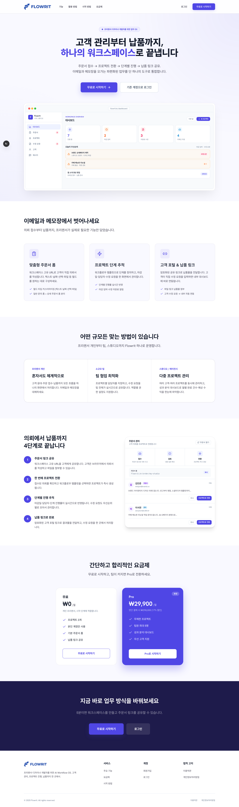
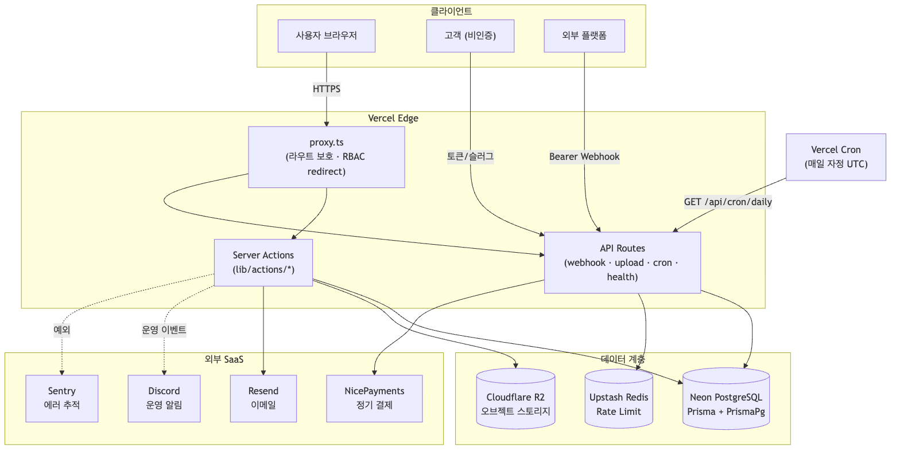
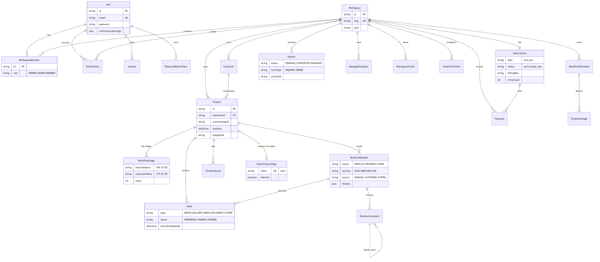
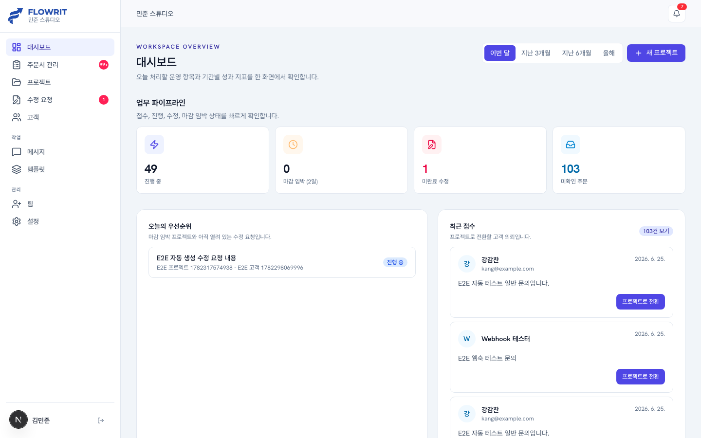
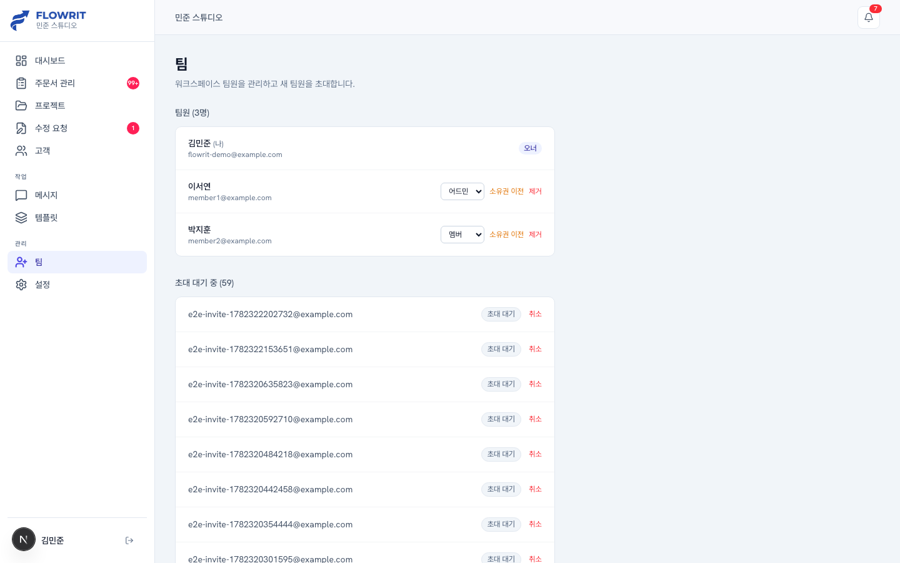
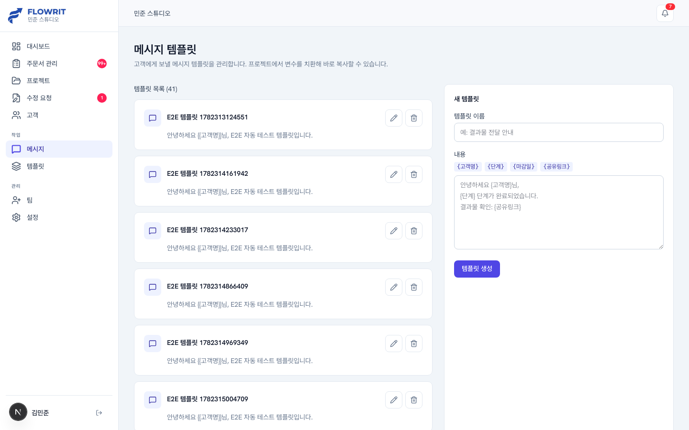

# Flowrit

> 프리랜서 디자이너·개발자를 위한 **워크플로우 & 고객관리(CRM) SaaS** — 고객 관리부터 납품까지 하나의 워크스페이스에서.

주문서 접수 → 프로젝트 전환 → 단계별 진행 → 납품 링크 공유로 이어지는 프리랜서의 업무 흐름을, 이메일과 메모장에 흩어진 방식에서 단일 도구로 통합한 SaaS입니다.



> 📄 **설계 배경 · 시스템 아키텍처 · ERD · 핵심 솔루션 · 트러블슈팅 · 배포/운영** 상세는 [**portfolio.md**](portfolio.md)에서 다이어그램과 함께 확인할 수 있습니다.

## 목차

- [주요 기능](#주요-기능)
- [기술 스택](#기술-스택)
- [아키텍처](#아키텍처)
- [데이터 모델](#데이터-모델)
- [화면](#화면)
- [로컬 실행](#로컬-실행)
- [테스트](#테스트)
- [프로젝트 구조](#프로젝트-구조)

## 주요 기능

| 영역 | 설명 |
|---|---|
| **고객 관리** | 고객 등록·검색·메모, 고객별 프로젝트 이력 |
| **프로젝트 진행** | 워크플로우 템플릿 기반 단계 관리, 담당자 배정, 마감 추적 |
| **주문서 폼 빌더** | 워크스페이스별 공개 주문 페이지(`/order/[slug]`)와 커스텀 입력 필드 구성 |
| **외부 의뢰 연동** | 외부 플랫폼 의뢰를 Bearer 인증 Webhook(`/api/webhooks/intake`)으로 수신 |
| **수정 요청** | 작업자·고객 양방향 수정 요청과 댓글 스레드 |
| **고객 포털** | 토큰 기반 공개 프로젝트 페이지(`/p/[token]`)로 진행 상황·납품물 공유 |
| **팀 협업** | OWNER/ADMIN/MEMBER 역할 기반 접근 제어(RBAC), 초대·소유권 이전 |
| **분석 대시보드** | 완료율·수정 요청 출처·팀원 워크로드 시각화(Recharts) |
| **알림** | 인앱 알림 + Resend 이메일 통합 발송 |
| **구독 결제** | Free/Pro 플랜, NicePayments 빌링키 기반 정기 결제 |
| **운영 관측** | Sentry 에러 추적, Discord 운영 알림(민감정보 마스킹), Health Check |

## 기술 스택

- **프레임워크**: Next.js 16 (App Router, Turbopack) · React 19
- **언어**: TypeScript
- **스타일**: Tailwind CSS v4 + 자체 디자인 시스템(`flowrit-*` 컴포넌트 클래스)
- **인증**: NextAuth v5 (Credentials + JWT 세션)
- **데이터베이스**: PostgreSQL (Neon) + Prisma 7
- **결제**: NicePayments (정기 결제 빌링키)
- **스토리지**: Cloudflare R2 (S3 호환, presigned URL 업로드)
- **메일**: Resend · **레이트 리밋**: Upstash Redis · **알림**: Discord Webhook
- **관측**: Sentry
- **테스트**: Vitest (단위) · Playwright (E2E, desktop/mobile)
- **배포**: Vercel + Vercel Cron (마감 알림·정기 결제)

## 아키텍처



```
클라이언트 컴포넌트 (use client)
      │  form action / Server Action 직접 호출
      ▼
Server Action (lib/actions/*.ts)   ← 인증 검증 + 권한(RBAC) + DB 접근
      ▼
Prisma Client (lib/db.ts)   →   PostgreSQL (Neon)
```

- **라우트 그룹**: `(auth)` 미인증 · `(dashboard)` 인증 필요. 공개 페이지(`/order`, `/p/[token]`, `/intake`)는 토큰·슬러그 기반으로 분리.
- **라우트 보호**: `proxy.ts`(Next.js 16 미들웨어)가 미인증 리다이렉트와 MEMBER 역할 접근 제어를 담당.
- **세션**: JWT에 `userId`·`workspaceId`·`role`을 담아 서버 액션에서 권한 판별.
- **변경 작업**: 별도 REST 레이어 없이 Server Action으로 처리하고 `revalidatePath`로 캐시 무효화.
- **운영 안정성**: Cron 실패·결제 실패·이메일 실패·웹훅 실패를 Discord로 알림(`ops-sanitize`로 secret 마스킹), 로그인·접수 엔드포인트에 Upstash 레이트 리밋.

## 데이터 모델

`Workspace`를 루트 테넌트로 모든 데이터가 `workspaceId` 범위로 격리되는 멀티테넌트 스키마입니다. 전체 ERD와 도메인 상태 흐름은 [portfolio.md](portfolio.md#4-데이터-모델-erd) 참고.



## 화면

| 대시보드 | 팀 관리(RBAC) | 메시지 템플릿 |
|---|---|---|
|  |  |  |

## 로컬 실행

```bash
# 1. 의존성 설치
npm install

# 2. 환경 변수 설정 (.env.example 참고)
cp .env.example .env.local
#   필수: DATABASE_URL, AUTH_SECRET, AUTH_URL

# 3. DB 스키마 적용 + Prisma Client 생성
npx prisma migrate deploy
npx prisma generate

# 4. (선택) 데모 데이터 시드 — flowrit-demo@example.com / demo1234
node prisma/seed.cjs

# 5. 개발 서버
npm run dev   # http://localhost:3000
```

> 환경 변수 전체 목록과 용도는 `.env.example`을 참고하세요. Resend·Upstash·Sentry·NicePayments·R2 키는 미설정 시 해당 기능만 비활성화되며 앱은 정상 동작합니다.

## 테스트

```bash
npm test             # Vitest 단위 테스트 (168 tests)
npm run typecheck    # tsc --noEmit
npm run lint         # ESLint
npx playwright test  # E2E (E2E_TEST_EMAIL / E2E_TEST_PASSWORD 필요)
```

## 프로젝트 구조

```
app/
├── (auth)/        ← 로그인·회원가입·비밀번호 재설정
├── (dashboard)/   ← 인증 필요 대시보드 (고객·프로젝트·수정요청·팀·설정·분석)
├── api/           ← NextAuth · Webhook · Cron · 업로드 · Health · 내보내기
├── order/         ← 공개 주문서 페이지
├── intake/        ← 공개 문의 접수 페이지
└── p/[token]/     ← 고객용 공개 프로젝트 포털
lib/
├── actions/       ← 도메인별 Server Actions
├── auth.ts        ← NextAuth 설정
├── db.ts          ← Prisma 싱글턴
├── notifications.ts · email.ts · ops-alert.ts · storage.ts · ratelimit.ts
components/        ← 공유 UI (디자인 시스템 · 모달 · 확인 다이얼로그)
prisma/            ← schema.prisma · 마이그레이션 · seed
tests/             ← Vitest 단위 + Playwright E2E
```
