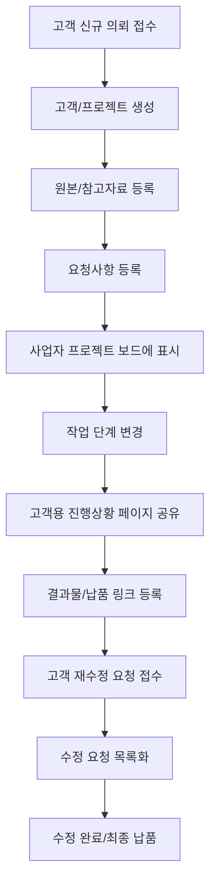

# MVP 계획서

> 목적: 이전 프로젝트 검토 결과를 바탕으로 AI Workflow OS의 첫 번째 유료 파일럿과 웹 MVP 범위를 확정한다.

## 1. MVP 목표

초기 MVP의 목표는 완성형 SaaS 출시가 아니라, 파일 기반 업무 사업자가 실제로 돈을 내고 사용할 만큼 강한 운영 문제를 검증하는 것이다.

기존 `gohoc`와 `ourwedding` 레포 분석 결과, 고객 접수 포털, 재수정 접수, 관리자 작업 큐, 작업자 배정, 파일 전송 흐름은 이미 업무 경험을 통해 부분 검증된 자산으로 본다. 따라서 MVP는 처음부터 완전히 새로 상상하지 않고, 기존 흐름을 SaaS형 구조로 일반화하는 방향으로 설계한다.

핵심 검증 질문:

- 고객별 진행상황, 수정 요청, 납품 링크를 한곳에서 관리하면 실제 업무 시간이 줄어드는가?
- 고객용 진행상황 페이지가 “지금 어디까지 됐나요?” 문의를 줄이는가?
- 사용자는 이 문제 해결에 세팅비 또는 월 구독료를 지불하는가?
- 노션 기반 수동 MVP에서 반복 사용되는 기능은 무엇인가?

## 2. 초기 타겟

### 1차 타겟

이전 프로젝트 검토 결과에 따라 확정한다. 기본 가설은 웨딩/사진 작가 또는 파일 기반 작업 사업자다.

### 타겟 조건

- 고객별 의뢰를 반복적으로 받는다.
- 파일 또는 링크 납품이 있다.
- 수정 요청이 발생한다.
- 고객이 진행상황을 문의한다.
- 카카오톡, 이메일, 드라이브, 엑셀 등을 혼합해서 사용한다.

## 3. 핵심 문제

MVP는 아래 3개 문제에 집중한다.

1. 신규 의뢰 접수 시 파일, 참고자료, 요청사항이 구조화되지 않는다.
2. 수정 요청이 대화 속에 묻혀 누락된다.
3. 납품 파일 링크와 버전이 흩어진다.
4. 고객이 진행상황을 반복해서 문의한다.

## 4. 핵심 사용자 흐름

## 5. 1차 MVP 기능 범위

### 필수 기능

| 기능 | 설명 | 성공 기준 |
|---|---|---|
| 고객 등록 | 고객 이름, 연락처, 메모 관리 | 고객별 프로젝트를 연결할 수 있음 |
| 프로젝트 생성 | 의뢰 단위 프로젝트 생성 | 고객별 진행상태 확인 가능 |
| 신규 의뢰 접수 페이지 | 고객이 파일, 참고자료, 요청사항을 직접 제출 | 사업자가 카톡으로 자료를 다시 정리하지 않음 |
| 재수정 접수 페이지 | 기존 프로젝트에 수정 요청과 파일을 추가 제출 | 수정 요청이 별도 목록으로 남음 |
| 상태별 작업 큐 | 주문확인, 신규, 재수정, 작업자현황, 파일전송 등 상태별 목록 | 사업자가 오늘 처리할 건을 바로 확인 |
| 단계 상태 관리 | 업종별 업무 단계 표시 및 상태 변경 | 현재 단계가 한눈에 보임 |
| 담당자 배정 | 프로젝트 또는 작업 단위 담당자 지정 | 외주/팀 작업량을 확인할 수 있음 |
| 수정 요청 등록 | 요청 내용, 대상, 상태, 우선순위 기록 | 요청 누락을 줄일 수 있음 |
| 파일/링크 등록 | 외부 스토리지 URL 또는 업로드 파일, 버전, 상태 기록 | 납품 링크를 다시 찾기 쉬움 |
| 고객용 진행상황 페이지 | 고객에게 공유 가능한 읽기 전용 페이지 | 고객이 현재 상태를 직접 확인 |
| 메시지 복사 버튼 | 카카오톡/문자용 안내문 생성 | 반복 안내문 작성 시간 감소 |
| 오늘 할 일 | 마감 임박/미완료 요청 표시 | 당일 처리할 작업 확인 가능 |

### 1차 MVP 제외 기능

| 제외 기능 | 제외 이유 |
|---|---|
| 대용량 파일 직접 저장 | 비용과 기술 난이도가 높고 핵심 가치가 아님 |
| 카카오톡 자동 연동 | 정책/개발 리스크가 크며 수동 복사로 먼저 검증 가능 |
| 고급 AI 챗봇 | 초기 고객은 챗봇보다 누락 방지와 상태 공유가 더 중요 |
| 복잡한 자동화 빌더 | 설정 부담이 크고 MVP 검증에 과함 |
| 다중 업종 템플릿 | 첫 타겟 검증 전에는 범위가 넓어짐 |
| 정교한 권한 관리 | 초기 파일럿에서는 단순 소유자/고객 공유로 충분 |

## 6. 노션 기반 수동 MVP

웹 개발 전에 노션으로 먼저 운영한다.

### 구성 DB

| DB | 주요 속성 |
|---|---|
| 고객 DB | 고객명, 연락처, 채널, 메모, 프로젝트 수 |
| 프로젝트 DB | 프로젝트명, 고객, 현재 단계, 마감일, 상태, 공유 링크 |
| 수정 요청 DB | 프로젝트, 요청 내용, 대상 파일, 우선순위, 상태, 접수일 |
| 파일/링크 DB | 프로젝트, 파일명, URL 또는 업로드 파일, 버전, 상태, 만료일 |
| 메시지 템플릿 DB | 상황, 메시지 본문, 사용 채널 |

### 고객 공유 페이지

고객에게 공유하는 페이지에는 아래 정보만 노출한다.

- 프로젝트명
- 현재 진행 단계
- 예정일
- 전달된 파일 링크
- 접수된 수정 요청 상태
- 최종 납품 상태

내부 메모, 가격, 작업자용 체크리스트는 노출하지 않는다.

## 7. 웹 MVP 데이터 모델 초안

| 엔티티 | 설명 | 주요 속성 |
|---|---|---|
| User | 서비스 사용자 | id, name, email, role |
| Workspace | 사업자/팀 단위 공간 | id, name, plan |
| TeamMember | 작업자/담당자 | id, workspaceId, name, role, active |
| Customer | 고객 | id, workspaceId, name, contact, memo |
| Project | 고객 의뢰 프로젝트 | id, customerId, assigneeId, title, internalStatus, publicStatus, dueDate, currentStageId |
| WorkflowTemplate | 업종별 단계 템플릿 | id, workspaceId, name, industry |
| WorkflowStage | 프로젝트 단계 | id, projectId, name, order, status |
| RevisionRequest | 수정 요청 | id, projectId, assetId, content, priority, status |
| Asset | 외부 링크 또는 업로드 파일 | id, projectId, type, source, url, storageKey, version, status, expiredAt |
| PublicProjectPage | 고객 공유 페이지 | id, projectId, token, isActive |
| MessageTemplate | 안내 메시지 템플릿 | id, workspaceId, type, content |
| TimelineEvent | 프로젝트 이벤트 | id, projectId, title, eventType, createdAt |

## 8. 화면 목록

### 내부 사용자 화면

| 화면 | 목적 |
|---|---|
| 대시보드 | 오늘 할 일, 지연 위험, 진행 중 프로젝트 확인 |
| 상태별 작업 큐 | 주문확인, 신규, 재수정, 작업자현황, 파일전송 목록 |
| 고객 목록 | 고객 검색 및 프로젝트 연결 |
| 프로젝트 상세 | 단계, 수정 요청, 파일 링크, 메시지 관리 |
| 신규 접수 관리 | 고객이 제출한 신규 의뢰 확인 |
| 재수정 관리 | 접수된 재수정 요청 확인 및 처리 |
| 수정 요청 목록 | 미완료 요청 확인 및 상태 변경 |
| 파일 링크 목록 | 납품 링크와 버전 관리 |
| 담당자 관리 | 담당자 목록과 배정된 작업량 확인 |
| 템플릿 설정 | 업종별 단계 템플릿 관리 |

### 고객 화면

| 화면 | 목적 |
|---|---|
| 고객용 진행상황 페이지 | 현재 단계, 예정일, 납품 링크, 수정 요청 상태 확인 |
| 신규 의뢰 접수 페이지 | 원본/참고자료/요청사항 제출 |
| 재수정 접수 페이지 | 기존 프로젝트에 수정 요청과 자료 제출 |

## 9. 4주 실행 계획

### 1주차: 이전 프로젝트 분석 및 수동 MVP 정리

- 이전 프로젝트 검토 프레임 작성
- `gohoc` / `ourwedding`의 실제 상태값과 파일 타입 정리
- 가장 강한 반복 문제 1개 확정
- 노션 템플릿에 실제 프로젝트 1건 입력
- 고객 공유 페이지 초안 작성
- 파일럿 제안 문구 작성

완료 기준:

- 과거 프로젝트 1건이 노션 템플릿에 실제 데이터로 재현됨
- MVP 포함/제외 기능이 1차 확정됨

### 2주차: 파일럿 제안

- 기존 네트워크 10명 리스트업
- 10명에게 파일럿 제안
- 3명에게 데모 설명
- 1명 이상 저가 유료 파일럿 전환 시도

완료 기준:

- 파일럿 후보 3명 이상 확보
- 최소 1명에게 가격 제안 완료

### 3주차: 실제 운영

- 파일럿 고객 프로젝트 세팅
- 진행상황 페이지 공유
- 수정 요청과 파일 링크 실제 등록
- 고객 반응 기록
- 입력이 귀찮은 지점 기록

완료 기준:

- 실제 프로젝트 1건 이상 운영
- 수정 요청 또는 파일 링크가 실제로 등록됨
- 고객 공유 페이지가 실제로 전달됨

### 4주차: 웹 MVP 범위 확정

- 반복 사용 기능 정리
- 버려진 기능 정리
- 웹 MVP 화면 목록 확정
- 데이터 모델 확정
- 개발 우선순위 작성

완료 기준:

- 개발할 기능과 개발하지 않을 기능이 명확히 분리됨
- 웹 MVP 개발 착수 여부 결정

## 10. 웹 MVP 개발 착수 조건

아래 조건 중 4개 이상 충족하면 개발에 들어간다.

- 노션 템플릿으로 실제 프로젝트를 1건 이상 운영했다.
- 파일럿 고객이 고객용 진행상황 페이지를 실제로 공유했다.
- 수정 요청 또는 파일 링크 관리 기능이 반복 사용되었다.
- 최소 1명이 유료 결제 또는 명확한 결제 의향을 보였다.
- 기존 방식 대비 시간이 줄었다는 피드백이 있다.
- 고객이 “계속 쓰고 싶다”고 말했다.

기존 레포를 기반으로 개발에 들어가는 경우에는 아래 조건도 추가로 확인한다.

- 기존 코드 재사용 범위가 고객 접수 UI인지, 전체 시스템 리팩토링인지 결정했다.
- 파일 전략을 외부 링크 우선으로 둘지, 업로드 옵션을 포함할지 결정했다.
- 내부 상태와 고객 표시 상태를 분리하는 데이터 모델을 확정했다.
- 상태별 작업 큐의 1차 메뉴를 확정했다.

## 11. 성공 기준

### 파일럿 성공 기준

- 파일럿 고객 3명 확보
- 유료 결제 1명 이상
- 실제 프로젝트 5건 이상 관리
- 고객 공유 페이지 5회 이상 공유
- 수정 요청 20건 이상 등록

### MVP 성공 기준

- 유료 고객 5곳
- 프로젝트 20건 이상 등록
- 고객용 진행상황 페이지가 핵심 사용 기능으로 확인
- 사용자가 매주 2회 이상 접속
- 월 29,000원 이상 지불 의향 확인

## 12. 다음 결정 사항

아래 항목은 이전 프로젝트 검토 후 확정한다.

| 항목 | 결정 필요 |
|---|---|
| 첫 타겟 업종 | 예: 웨딩/사진, 영상 편집, 디자인 |
| 첫 유료 파일럿 가격 | 예: 10만원, 20만원, 30만원 |
| 고객 공유 페이지 노출 범위 | 수정 요청까지 노출할지, 상태만 노출할지 |
| 웹 MVP 기술 스택 | Next.js 단일 앱 또는 별도 백엔드 |
| AI 1차 기능 | 제외 또는 수정 요청 구조화 |
