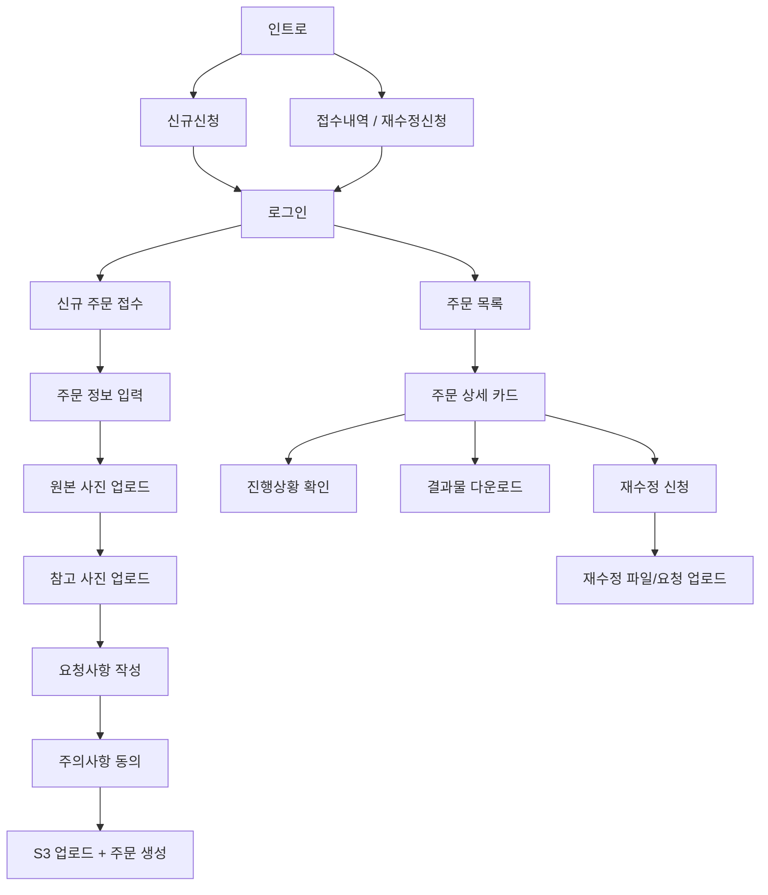

# gohoc 레포 분석

> 대상 레포: `https://github.com/motionbit95/gohoc.git`
> 로컬 경로: `_reference/gohoc`
> 분석 목적: 기존 프로젝트에서 검증된 업무 흐름을 AI Workflow OS의 MVP 범위로 전환한다.

## 1. 프로젝트 요약

`gohoc`는 `스튜디오고혹` / `아워웨딩` 업무를 위한 Next.js 기반 고객 접수 포털이다.

핵심 기능은 고객이 로그인 후 신규 보정 주문 또는 재수정 신청을 접수하고, 원본/참고 이미지와 요청사항을 업로드하며, 접수 내역에서 진행상황과 결과물을 확인하는 흐름이다.

즉, 이 레포는 AI Workflow OS 아이디어 중 다음 영역을 이미 부분적으로 구현하고 있다.

- 고객 의뢰 접수
- 고객 정보 생성
- 원본/참고 파일 업로드
- 수정 요청 접수
- 주문별 진행상황 노출
- 결과물 다운로드
- 코멘트/타임라인 기록

## 2. 기술 구조

| 항목 | 내용 |
|---|---|
| 프레임워크 | Next.js 15 |
| UI | React 19, MUI 7, Minimals 템플릿 기반 |
| 인증 | JWT 기반, `localStorage` token 사용 |
| API 연동 | `NEXT_PUBLIC_API_URL` 기준 REST API |
| 파일 처리 | S3 presigned upload/download |
| 주요 앱 경로 | `/`, `/login`, `/new`, `/revision`, `/revision/[id]` |

## 3. 주요 화면 흐름

## 4. 주요 도메인 모델

코드에서 확인되는 핵심 엔티티는 아래와 같다.

| 엔티티 | 현재 레포 표현 | AI Workflow OS 대응 |
|---|---|---|
| User | `user`, `naver_id`, `user_name` | 사업자 사용자 또는 고객 계정 |
| Customer | `/customer`, `customer.name`, `customer.email` | 고객 |
| Order | `/order`, `orderNumber`, `grade`, `process`, `expiredDate` | 프로젝트 |
| WorkSubmission | `/work-submission`, `type`, `files` | 파일 제출/에셋 묶음 |
| File | `/file`, S3 파일 메타데이터 | AssetLink / AssetFile |
| Comment | `/comment`, `step`, `comment` | 요청사항 / 수정 요청 |
| Timeline | `/timeline`, `title` | 프로젝트 이벤트 로그 |

## 5. 현재 구현된 핵심 기능

### 신규 주문 접수

파일: `_reference/gohoc/src/sections/new/view/order-view.js`

흐름:

1. 로그인 토큰 확인
2. 사용자 정보 조회
3. 주문번호, 등급, 사진 수량 입력
4. 원본 이미지 업로드
5. 참고 이미지 업로드
6. 요청사항 작성
7. 주의사항 전체 동의
8. S3 presigned URL 발급
9. 파일 업로드 및 서버 확인
10. 고객 생성
11. 주문 생성
12. 타임라인 생성
13. 작업 제출물 생성
14. 코멘트 생성

### 재수정 신청

파일: `_reference/gohoc/src/sections/revision/view/revision-form-view.js`

흐름:

1. 주문 ID로 기존 주문 조회
2. 사용자 정보 조회
3. 재수정 파일 업로드
4. 참고 파일 업로드
5. 재수정 요청사항 작성
6. 주의사항 동의
7. 작업 제출물 생성
8. 코멘트 생성
9. 주문 상태를 `재수정 작업 진행중`으로 업데이트
10. 타임라인에 `재수정 접수` 기록

### 접수 내역 / 진행상황

파일: `_reference/gohoc/src/sections/revision/view/order-list-view.js`, `_reference/gohoc/src/sections/revision/order-box.js`

흐름:

1. 로그인 사용자 조회
2. `naver_id` 기준 주문 목록 조회
3. 주문자, 접수일, 등급, 사진 장수, 요청사항, 진행상황 표시
4. 결과물 미리보기/다운로드 버튼 제공
5. 조건 충족 시 재수정 신청 가능

### 파일 업로드/다운로드

파일: `_reference/gohoc/src/actions/order.js`, `_reference/gohoc/src/sections/revision/normal-buttons.js`, `_reference/gohoc/src/sections/revision/sample-buttons.js`

특징:

- 업로드 전 브라우저에서 SHA-256 파일 해시 계산
- 서버에서 presigned upload URL 발급
- 업로드 후 서버에 confirm 요청
- 다운로드 시 S3 URL을 presigned URL로 변환
- 여러 파일을 브라우저에서 ZIP으로 묶어 다운로드

## 6. AI Workflow OS 관점에서 이미 검증된 것

### 강하게 검증된 문제

1. 고객은 작업 요청을 구조화해서 제출해야 한다.
2. 원본 파일, 참고 파일, 수정 파일은 구분되어야 한다.
3. 수정 요청은 별도 접수 흐름이 필요하다.
4. 고객은 접수 내역과 진행상황을 직접 확인하고 싶어 한다.
5. 결과물 다운로드 가능 여부는 작업 상태에 따라 제어되어야 한다.
6. 파일은 일정 기간 보관 후 파기된다는 안내가 중요하다.

### 제품화 가치가 큰 기능

- 고객용 신규 의뢰 접수 페이지
- 고객용 재수정 접수 페이지
- 고객용 진행상황 페이지
- 파일 업로드/다운로드 상태 제어
- 주문/프로젝트 타임라인
- 요청사항 템플릿
- 주의사항 동의 체크
- 등급/마감일 기반 일정 계산

## 7. 현재 레포의 한계

AI Workflow OS로 확장하려면 아래가 부족하다.

| 한계 | 설명 | MVP 보완 방향 |
|---|---|---|
| 관리자 대시보드 부재 | 고객 접수는 있지만 사업자가 전체 프로젝트를 운영하는 화면이 약함 | 프로젝트 보드, 상태 변경, 지연 위험 표시 추가 |
| 업종 고정 | 아워웨딩/사진 보정에 강하게 묶임 | WorkflowTemplate으로 일반화 |
| 파일 직접 업로드 중심 | 새 사업 방향은 외부 스토리지 링크 중심 | 업로드와 외부 링크를 모두 Asset으로 추상화 |
| 수정 요청이 코멘트 중심 | 요청 단위 상태, 우선순위, 완료 처리가 약함 | RevisionRequest 엔티티 분리 |
| 고객 계정 기반 | 빠른 공유 링크 방식이 부족 | 토큰 기반 고객용 공개 페이지 추가 |
| 자동화 부재 | 상태 변경 시 안내문, 리마인드 등이 없음 | 메시지 템플릿 복사부터 시작 |

## 8. MVP 전환 방향

기존 레포를 그대로 확장한다면 방향은 다음과 같다.

### 유지할 것

- 신규 접수 흐름
- 재수정 접수 흐름
- 고객용 진행상황 확인
- 파일/참고자료 구분
- 타임라인 개념
- 주의사항 동의
- 요청사항 템플릿

### 새로 추가할 것

- 사업자용 프로젝트 대시보드
- 고객/프로젝트/수정요청/에셋 통합 상세 화면
- 단계 기반 워크플로우
- 외부 파일 링크 관리
- 고객용 공유 링크
- 상태 변경 메시지 복사
- 오늘 할 일/마감 임박 표시

### 줄이거나 나중으로 미룰 것

- 대용량 파일 직접 저장을 기본값으로 두는 방식
- 복잡한 관리자 권한 체계
- 여러 업종 동시 지원
- 완전한 카카오톡 연동
- 고급 AI 챗봇

## 9. 추천 MVP 정의

기존 `gohoc`를 참고한 1차 MVP는 “고객 접수 포털 + 사업자 운영 대시보드”다.

한 문장:

> 고객이 파일과 요청사항을 직접 접수하고, 사업자는 고객별 진행상황·수정요청·납품 링크를 하나의 보드에서 관리하는 워크플로우 SaaS

1차 MVP 기능:

- 고객 등록
- 프로젝트 생성
- 신규 의뢰 접수 페이지
- 수정 요청 접수 페이지
- 프로젝트 단계 관리
- 수정 요청 목록
- 파일 링크/업로드 관리
- 고객용 진행상황 페이지
- 결과물 전달 상태
- 메시지 복사 버튼

## 10. 다음 설계 질문

정식 MVP spec으로 넘어가기 전에 아래를 결정해야 한다.

1. 기존 `gohoc` 코드를 기반으로 리팩토링할지, 새 프로젝트로 다시 만들지
2. 1차 파일 전략을 S3 업로드 중심으로 둘지, 외부 링크 중심으로 둘지
3. 고객이 반드시 로그인해야 하는지, 공유 링크로도 접근 가능해야 하는지
4. 첫 타겟을 아워웨딩/사진 보정으로 유지할지, 웨딩/사진 작가 일반으로 넓힐지
5. 관리자 대시보드에서 가장 먼저 필요한 상태값은 무엇인지

