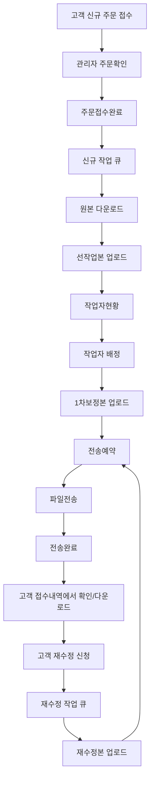

# ourwedding 레포 분석

> 대상 레포: `https://github.com/motionbit95/ourwedding.git`
> 로컬 경로: `_reference/ourwedding`
> 분석 목적: 기존 운영 시스템의 고객 접수, 관리자 처리, 작업자 배정, 파일 전송 흐름을 AI Workflow OS MVP에 반영한다.

## 1. 프로젝트 요약

`ourwedding`은 사진 보정/웨딩 관련 주문을 처리하기 위한 React 기반 프론트엔드와 Firebase Functions 기반 백엔드를 포함한 운영 시스템이다.

`gohoc`가 더 최근의 Next.js 고객 포털 성격이라면, `ourwedding`은 다음을 포함한 더 넓은 운영 경험이 담겨 있다.

- 브랜드별 고객 접수 페이지
- 신규 주문 접수
- 재수정 신청
- 관리자 로그인/회원가입
- 관리자 주문 확인
- 신규 작업 처리
- 재수정 작업 처리
- 선작업/1차보정 업로드
- 작업자 배정
- 파일 전송 예약/완료
- Firebase Realtime Database 기반 주문 관리
- Firebase Storage/Google Drive 기반 파일 이동

## 2. 기술 구조

| 항목 | 내용 |
|---|---|
| 프론트엔드 | Create React App, React 19, React Router |
| UI | Ant Design, styled-components |
| 백엔드 | Express on Firebase Functions |
| DB | Firebase Realtime Database |
| Storage | Firebase Storage, Google Drive |
| 인증 | 고객: 이름+네이버 ID 기반 JWT, 관리자: ID/PW + bcrypt + JWT |
| 문서 | Swagger 설정 존재 |

## 3. 라우트 구조

### 고객/브랜드 라우트

| 브랜드 | 주요 흐름 |
|---|---|
| Ourwedding | 인트로, 로그인, 신규 신청, 재수정 목록, 재수정 폼 |
| WantsWedding | 인트로, 로그인, 신규 신청, 재수정 목록, 재수정 폼 |
| Taility | 인트로, 로그인, 신규 신청, 재수정 목록, 재수정 폼 |

이 구조는 AI Workflow OS의 `WorkflowTemplate` 또는 `IndustryTemplate` 개념으로 전환할 수 있다.

### 관리자 라우트

| 메뉴 | 역할 |
|---|---|
| 주문확인 | 신규 접수 주문 검토 및 접수 완료 처리 |
| 신규 | 주문접수완료 건의 원본 다운로드, 선작업본 업로드 |
| 재수정 | 재수정 요청 처리, 작업자 지정, 재수정본 업로드 |
| 선작업 | 선작업 단계 관리 |
| 작업자현황 | 작업자 배정, 원본/선작업/1차보정/재수정 파일 확인 |
| 파일전송 | 전송 예약/완료 처리 |

## 4. 백엔드 API 구조

| 라우트 | 역할 |
|---|---|
| `/auth` | 고객 회원가입, 로그인, 토큰 검증 |
| `/admin` | 관리자 회원가입, 로그인, 관리자 목록/조회 |
| `/order` | 주문 생성, 조회, 수정, 삭제, 필터링 |
| `/work` | 작업자별 작업량 등록/조회/수정/삭제 |
| `/upload` | URL 기반 파일 업로드 후 Google Drive 저장 |
| `/download-zip` | 여러 파일 ZIP 다운로드 |

## 5. 운영 워크플로우

## 6. 실제 상태값

코드에서 확인되는 운영 상태값은 다음과 같다.

| 상태/단계 | 의미 |
|---|---|
| 신규 | 신규 주문 접수 |
| 샘플 | 샘플 주문 접수 |
| 재수정 | 재수정 신청 |
| 주문접수완료 | 관리자가 주문 확인 완료 |
| 선작업 | 선작업본 업로드 후 다음 단계 |
| 작업중 | 작업자 처리 중 |
| 1차보정완료 | 1차 결과물 업로드 완료 |
| 재수정완료 | 재수정 결과물 업로드 완료 |
| 전송예약 | 고객에게 결과물 전송 대기 |
| 전송완료 | 결과물 전송 완료 |

이 상태값들은 1차 MVP의 사진/보정 업종 템플릿으로 사용할 수 있다.

## 7. 도메인 모델

| 현재 개념 | 주요 필드/표현 | AI Workflow OS 모델 |
|---|---|---|
| 주문 | `orderNumber`, `company`, `grade`, `division`, `step` | Project |
| 고객 | `userName`, `userId` | Customer |
| 브랜드/업체 | `company` | Workspace 또는 WorkflowTemplate |
| 작업자 | `worker`, `worker_id`, `admin_name` | Assignee / TeamMember |
| 원본 파일 | `photoDownload` | Asset(type=origin) |
| 참고 파일 | `referenceDownload` | Asset(type=reference) |
| 선작업본 | `preDownload`, `firstWorkDownload` 일부 혼재 | Asset(type=prework) |
| 1차보정본 | `firstWorkDownload` | Asset(type=firstDelivery) |
| 재수정 파일 | `revisionDownload`, `reWorkDownload` | RevisionRequest + Asset |
| 요청사항 | `comment` | Comment 또는 RevisionRequest.content |
| 진행상태 | `division`, `step`, `deadline` | WorkflowStage + Project.status |

## 8. AI Workflow OS에 주는 핵심 인사이트

1. 고객 포털만으로는 부족하다. 고객 접수/재수정 화면과 사업자용 상태별 작업 큐가 같이 있어야 한다.
2. 워크플로우 빌더보다 상태별 큐가 먼저다. `주문확인`, `신규`, `재수정`, `작업자현황`, `파일전송` 같은 메뉴가 실제 업무를 움직인다.
3. 파일은 에셋 타입으로 구분해야 한다. 원본, 참고, 선작업, 1차보정, 재수정, 전송본이 서로 다른 상태를 가진다.
4. 작업자 배정은 초기에도 가치가 있다. 복잡한 권한보다 담당자 배정과 작업량 표시부터 시작하면 된다.
5. 고객에게 보여줄 상태와 내부 상태는 분리해야 한다. 내부 상태 `작업자현황`은 고객에게 `보정 작업 진행 중`으로 보여야 한다.

## 9. 기존 시스템의 한계

| 한계 | 설명 | 새 MVP 반영 |
|---|---|---|
| 상태값이 문자열로 흩어짐 | `division`, `step`, `label`이 섞여 있음 | Stage/Status 모델로 정규화 |
| 파일 필드가 단계별로 분산 | `photoDownload`, `firstWorkDownload`, `reWorkDownload` 등 | Asset 모델로 통합 |
| 브랜드별 코드 중복 | ourwedding/wantswedding/taility 페이지가 유사 구조 | Template 기반으로 일반화 |
| 고객/관리자 경험 분리 약함 | 같은 주문 데이터에 여러 표현이 섞임 | PublicProjectPage와 InternalProject 분리 |
| 인프라가 특정 Firebase/Drive 구조에 의존 | SaaS 확장 시 고객별 스토리지 전략 필요 | 외부 스토리지 링크 우선, 업로드는 옵션화 |
| 자동화/알림 부재 | 상태 변경 후 고객 안내가 수동 | 메시지 템플릿 복사부터 도입 |

## 10. MVP 우선순위 재정의

두 레포를 검토한 결과, 1차 MVP 우선순위는 아래 순서가 적절하다.

1. 고객 신규 접수 페이지
2. 고객 재수정 접수 페이지
3. 사업자 상태별 작업 큐
4. 프로젝트 상세 화면
5. 파일/링크 에셋 관리
6. 고객용 진행상황 페이지
7. 담당자 배정
8. 메시지 복사 버튼
9. 마감일/지연 위험 표시
10. AI 요청사항 구조화

## 11. 추천 MVP 워크플로우 템플릿

사진/보정 업종 1차 템플릿:

1. 신규 접수
2. 주문 확인
3. 원본/참고자료 확인
4. 작업자 배정
5. 1차 작업 진행
6. 1차 결과 업로드
7. 고객 확인/전송
8. 재수정 접수
9. 재수정 작업 진행
10. 최종 납품
11. 완료/보관

## 12. 제품화 결론

이전 프로젝트들은 이미 파일 기반 작업 사업자에게 필요한 워크플로우를 작은 범위에서 증명했다.

따라서 새 사업은 완전히 새로운 아이디어라기보다, 기존 프로젝트에서 아워웨딩 전용으로 만들어졌던 기능을 다음처럼 SaaS화하는 것이 맞다.

> 특정 업체 전용 주문/보정 관리 시스템
> → 파일 기반 소규모 사업자를 위한 템플릿형 Workflow OS

