# Flowrit — 프리랜서를 위한 워크플로우 & CRM SaaS

> 고객 의뢰 접수부터 프로젝트 진행·수정 요청·납품·정기 결제까지, 프리랜서 디자이너·개발자의 업무 흐름을 단일 워크스페이스로 통합한 멀티테넌트 SaaS.

본 문서는 Flowrit 프로젝트의 **설계 배경 · 시스템 아키텍처 · 데이터 모델(ERD) · 핵심 솔루션 · 트러블슈팅 · 배포/운영**을 정리한 포트폴리오용 기술 문서입니다. 다이어그램은 Mermaid로 작성해 PNG로 렌더링했으며(소스는 `docs/diagrams/*.mmd`), 어떤 뷰어에서도 그대로 보이도록 이미지로 포함했습니다.

## 목차

- [1. 프로젝트 배경](#1-프로젝트-배경)
- [2. 기술 스택](#2-기술-스택)
- [3. 시스템 아키텍처](#3-시스템-아키텍처)
  - [3-1. 전체 토폴로지](#3-1-전체-토폴로지)
  - [3-2. 요청 처리 레이어](#3-2-요청-처리-레이어)
  - [3-3. 라우트 구조와 접근 경계](#3-3-라우트-구조와-접근-경계)
- [4. 데이터 모델 (ERD)](#4-데이터-모델-erd)
  - [4-1. 전체 ERD](#4-1-전체-erd)
  - [4-2. 도메인 상태 흐름](#4-2-도메인-상태-흐름)
- [5. 핵심 솔루션](#5-핵심-솔루션)
  - [5-1. 멀티테넌트 데이터 격리](#5-1-멀티테넌트-데이터-격리)
  - [5-2. 이중 레이어 RBAC](#5-2-이중-레이어-rbac)
  - [5-3. 의뢰 접수 → 프로젝트 전환 파이프라인](#5-3-의뢰-접수--프로젝트-전환-파이프라인)
  - [5-4. Presigned URL 직접 업로드](#5-4-presigned-url-직접-업로드)
  - [5-5. 토큰 기반 고객 포털](#5-5-토큰-기반-고객-포털)
  - [5-6. 정기 결제 (빌링키)](#5-6-정기-결제-빌링키)
  - [5-7. 통합 알림 시스템](#5-7-통합-알림-시스템)
- [6. 트러블슈팅](#6-트러블슈팅)
- [7. 배포 & 운영](#7-배포--운영)
  - [7-1. CI 파이프라인](#7-1-ci-파이프라인)
  - [7-2. 배포 흐름](#7-2-배포-흐름)
  - [7-3. 관측성 & 운영 알림](#7-3-관측성--운영-알림)
  - [7-4. 스케줄러](#7-4-스케줄러)
- [8. 품질 관리](#8-품질-관리)

---

## 1. 프로젝트 배경

프리랜서 디자이너·개발자는 **고객 의뢰 → 견적 → 작업 진행 → 피드백 반영 → 납품**의 흐름을 이메일·메신저·메모장·클라우드 드라이브에 흩어놓고 관리한다. 이로 인해:

- 어떤 의뢰가 어느 단계에 있는지 한눈에 파악하기 어렵다.
- 고객에게 진행 상황을 공유하려면 매번 수동으로 정리해야 한다.
- 수정 요청이 메신저에 묻혀 누락된다.
- 팀 단위로 일할 때 작업물·권한 관리가 안 된다.

**Flowrit**은 이 업무 흐름 전체를 하나의 워크스페이스로 통합한다. 핵심 가치는 다음 세 가지다.

| 가치 | 구현 |
|---|---|
| **접수 자동화** | 공개 주문서 폼 / 일반 문의 폼 / 외부 플랫폼 Webhook → 의뢰가 자동으로 워크스페이스에 쌓이고 알림 발송 |
| **고객 셀프서비스** | 토큰 기반 공개 포털로 고객이 로그인 없이 진행 상황 확인·수정 요청·납품물 다운로드 |
| **팀 협업** | OWNER/ADMIN/MEMBER 역할 기반 접근 제어, 담당자 배정, 워크로드 분석 |

> MVP 단계의 1인 풀스택 개발 프로젝트로, 요구사항 정의부터 설계·구현·테스트·배포·운영까지 전 과정을 단독 수행했다.

**대시보드** — 업무 파이프라인(진행/마감 임박/미완료 수정/미확인 주문)과 오늘의 우선순위·최근 접수를 한 화면에서 읽는다.

**메시지 템플릿** — `{고객명}`·`{단계}`·`{마감일}`·`{공유링크}` 변수를 치환해 고객 안내 메시지를 재사용한다.

---

## 2. 기술 스택

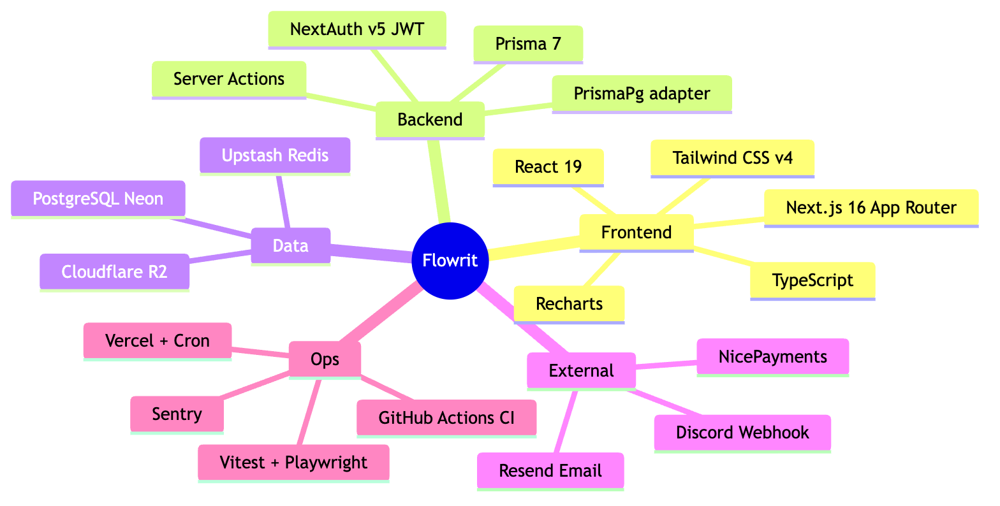

| 영역 | 선택 | 선택 이유 |
|---|---|---|
| 프레임워크 | **Next.js 16 (App Router)** · React 19 | Server Actions로 REST 레이어 없이 변경 작업 처리, 서버 컴포넌트로 데이터 페칭 단순화 |
| 인증 | **NextAuth v5 (Credentials + JWT)** | 세션을 JWT 단일 소스로 관리, 서버리스 친화 |
| ORM/DB | **Prisma 7 + PostgreSQL (Neon)** | 타입 안전 쿼리, Neon pooled connection으로 서버리스 연결 고갈 방지 |
| 스토리지 | **Cloudflare R2 (S3 호환)** | presigned URL 직접 업로드, egress 비용 절감 |
| 결제 | **NicePayments 빌링키** | 국내 정기 결제(구독) 지원 |
| 레이트 리밋 | **Upstash Redis** | 서버리스 환경에서 분산 sliding-window 제한 |
| 메일 | **Resend** | 트랜잭션 이메일(초대·알림·마감 리마인더) |
| 관측 | **Sentry + Discord Webhook** | 에러 추적 + 운영 이벤트 실시간 알림 |
| 배포 | **Vercel + Vercel Cron** | Git push 기반 자동 배포, 스케줄 작업 |
| 테스트 | **Vitest + Playwright** | 단위(166 tests) + E2E(desktop/mobile) |

---

## 3. 시스템 아키텍처

### 3-1. 전체 토폴로지

설계 원칙:

- **단일 BFF**: 별도 백엔드 서버 없이 Next.js가 프론트·서버 로직·API를 모두 담당. 변경 작업은 Server Action, 외부 연동·스케줄은 API Route로 분리.
- **외부 의존성 우아한 저하(graceful degradation)**: Resend·Upstash·Sentry·R2 등은 환경변수 미설정 시 해당 기능만 비활성화되고 앱 본체는 정상 동작한다. (예: Upstash 미설정 → rate limiter `null` → no-op)

### 3-2. 요청 처리 레이어

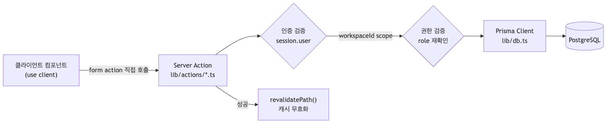

모든 변경 작업은 **① 세션 인증 → ② `workspaceId` 범위 제한 → ③ 역할 권한 재검증 → ④ Prisma 쿼리 → ⑤ `revalidatePath` 캐시 무효화** 의 동일 패턴을 따른다.

### 3-3. 라우트 구조와 접근 경계

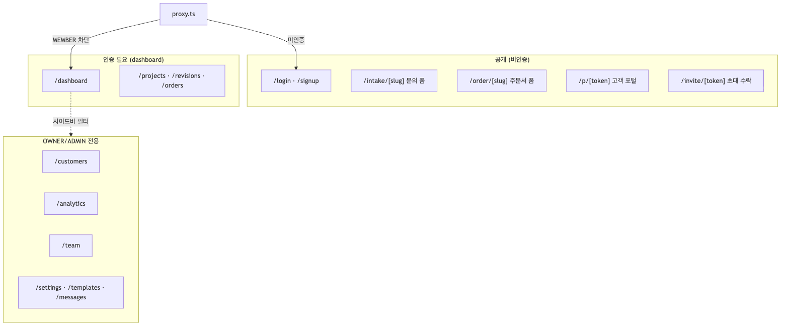

- `(auth)` 그룹은 미인증 페이지, `(dashboard)` 그룹은 인증 필수.
- 공개 페이지는 **토큰(`/p/[token]`)** 또는 **워크스페이스 슬러그(`/order/[slug]`)** 기반으로 격리.
- `proxy.ts`가 미인증 리다이렉트와 `MEMBER` 역할의 관리 경로 차단을 담당.

---

## 4. 데이터 모델 (ERD)

### 4-1. 전체 ERD

> **멀티테넌트 키**: `Workspace`가 모든 비즈니스 데이터의 루트 테넌트다. `Customer`·`Project`·`Inquiry`·`Notification` 등 거의 모든 테이블이 `workspaceId`를 보유하며, 이것이 데이터 격리(P-001)의 물리적 기반이다.

설계 포인트:

- **`WorkflowStage`의 이중 명칭**: 내부 표시명(`internalName`)과 고객 표시명(`customerName`)을 분리해, 고객에게는 "초안 검토 중"으로 보여주면서 내부적으로는 "1차 시안 QA"처럼 다르게 운용한다.
- **`RevisionComment` 자기참조**: `parentId`로 2단계 스레드(루트 댓글 + 답글)를 구성. 작업자(`WORKER`)와 고객(`CLIENT`)이 한 스레드에서 대화.
- **`Inquiry.formType`으로 폼 통합**: 일반 문의(`INQUIRY`)와 주문서(`ORDER`)를 단일 테이블로 통합하고 `formType`으로 구분 → 접수 처리 로직 단일화.
- **인덱스 전략**: `@@index([workspaceId, status])`(Inquiry), `@@index([projectId, status])`(RevisionRequest), `@@index([userId, isRead])`(Notification) 등 조회 패턴에 맞춘 복합 인덱스.

### 4-2. 도메인 상태 흐름

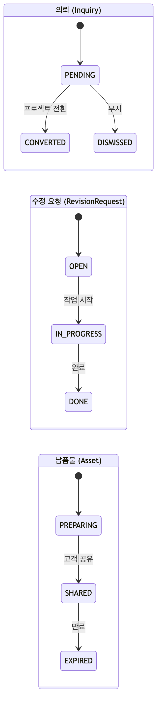

---

## 5. 핵심 솔루션

### 5-1. 멀티테넌트 데이터 격리

가장 중요한 보안 불변 원칙(constitution P-001). **모든 DB 쿼리는 `session.user.workspaceId` 범위로 제한**한다. 워크스페이스 필터 누락은 곧 타 테넌트 데이터 유출이므로 보안 결함으로 간주한다.

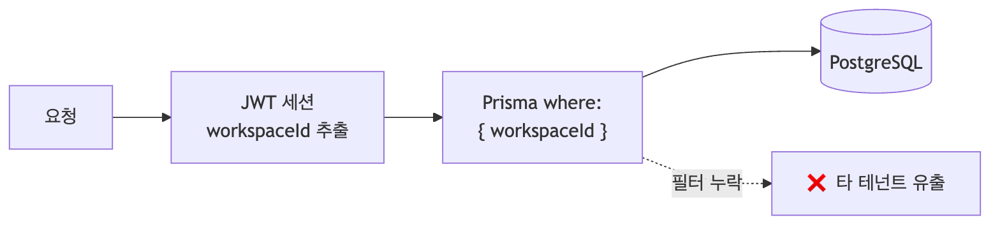

JWT 세션에 `id` · `workspaceId` · `role` 세 필드만 단일 소스로 저장하고, 모든 인증·권한 판단이 이 세 필드에서 출발한다.

### 5-2. 이중 레이어 RBAC

역할 기반 접근 제어를 **라우트 레이어와 UI 레이어 양쪽에서 중복 보호**한다(constitution P-002). 한쪽이 뚫려도 다른 쪽이 막는 방어 심층화 구조다.

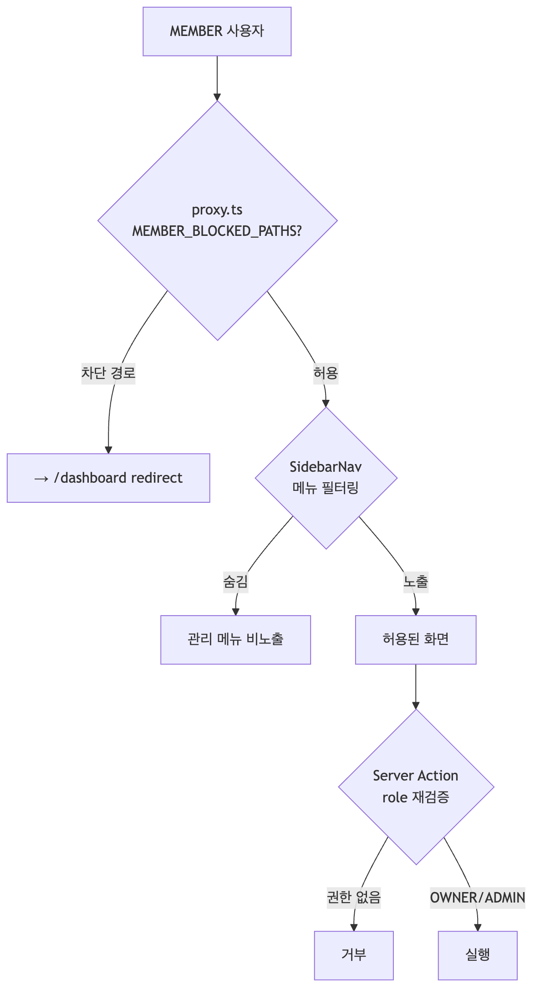

| 레이어 | 메커니즘 | 위치 |
|---|---|---|
| 라우트 | `MEMBER_BLOCKED_PATHS` 매칭 → redirect | `proxy.ts` |
| UI | 역할별 메뉴 필터 | `components/sidebar-nav.tsx` |
| 액션 | session role 재검증 | `lib/actions/*.ts` |

**팀 관리** — 역할(오너/어드민/멤버) 변경, 소유권 이전, 초대 발송·대기 관리.

### 5-3. 의뢰 접수 → 프로젝트 전환 파이프라인

3가지 채널(공개 문의 폼 / 주문서 폼 / 외부 Webhook)로 들어온 의뢰를 단일 `Inquiry` 테이블에 모으고, 검토 후 프로젝트로 전환한다.

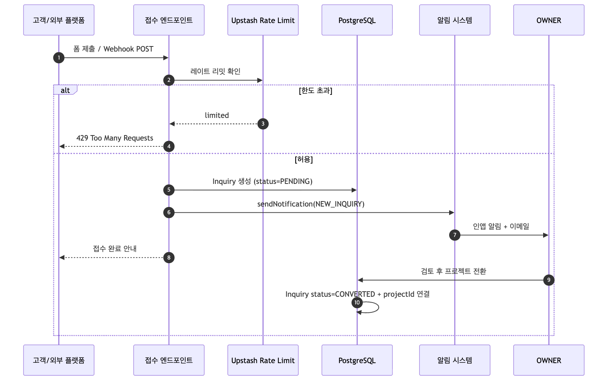

- **Webhook 인증**: 외부 플랫폼 의뢰는 `Authorization: Bearer` 토큰으로 검증.
- **레이트 리밋 정책**: 공개 폼 10분 5회 / Webhook 1분 60회 / 로그인 5분 10회 (sliding window).

### 5-4. Presigned URL 직접 업로드

파일이 서버 메모리를 통과하지 않고 **클라이언트 → R2 직접 업로드**하는 구조. 서버리스 함수의 메모리·실행시간 제약을 회피한다.

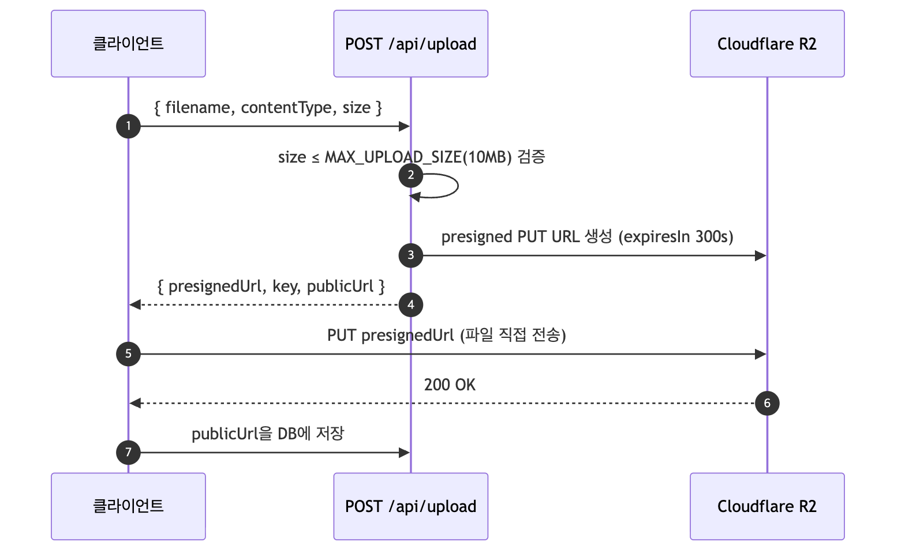

- **단일 소스 상수**: `MAX_UPLOAD_SIZE`(`lib/upload-constants.ts`)를 클라이언트·API가 공유(constitution P-005)하여 하드코딩 리터럴 금지.
- presigned URL 만료 300초로 단기 발급.

### 5-5. 토큰 기반 고객 포털

고객은 **로그인 없이** `/p/[token]` 으로 진행 상황·납품물을 확인하고 수정 요청을 남긴다. UUID 토큰이 자격 증명을 대체한다.

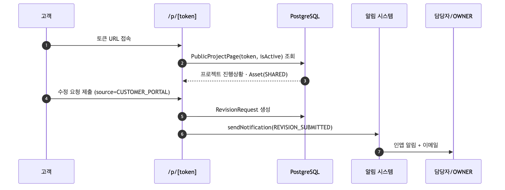

고객 표시명(`customerName`)만 노출하고 내부 표시명(`internalName`)은 숨겨, 외부에 내부 운영 정보가 새지 않도록 분리했다.

### 5-6. 정기 결제 (빌링키)

Free/Pro 구독을 NicePayments 빌링키로 정기 결제한다. 카드 인증으로 빌링키를 발급받아 저장하고, 매일 자정 크론이 만료 대상을 결제한다.

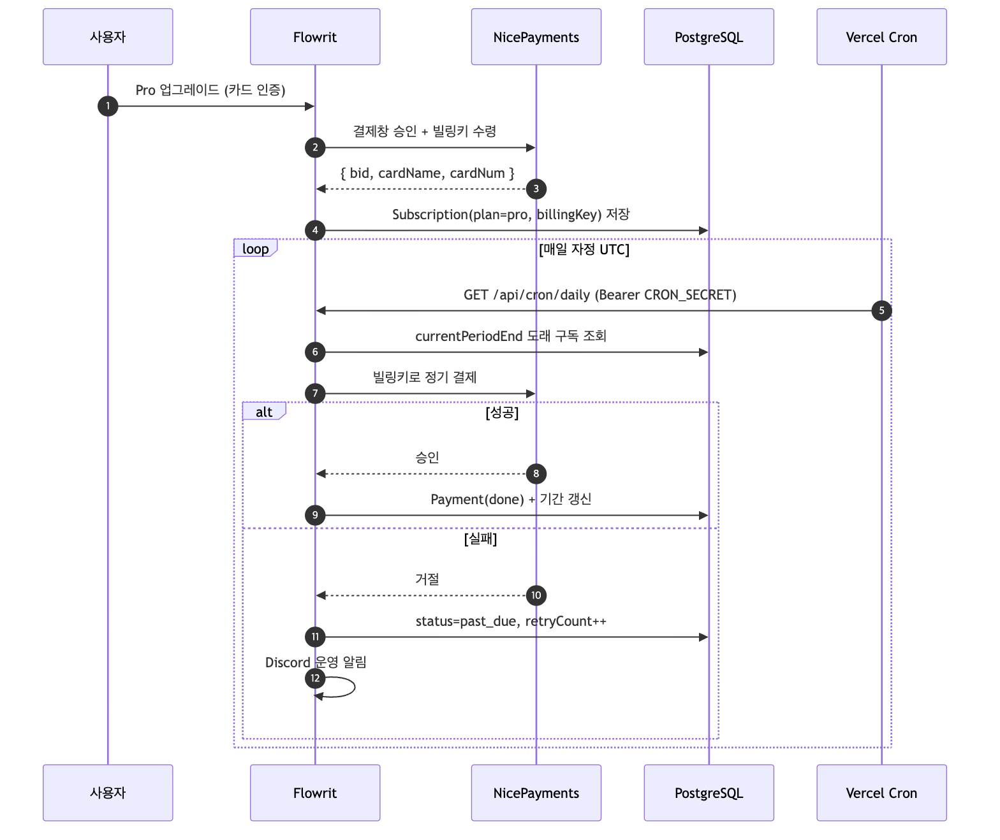

- 결제 승인 endpoint(`/v1/payments/{tid}`)와 빌링키 모델은 NicePayments 서버 승인 규격에 맞춰 구현.
- 결제 실패 시 `retryCount` 증가 + `past_due` 전환 + Discord 알림으로 운영자가 즉시 인지.

### 5-7. 통합 알림 시스템

인앱 알림과 이메일을 `sendNotification()` 단일 진입점으로 통합 발송한다. 사용자별 `notificationSettings` JSON으로 타입별 ON/OFF 제어.

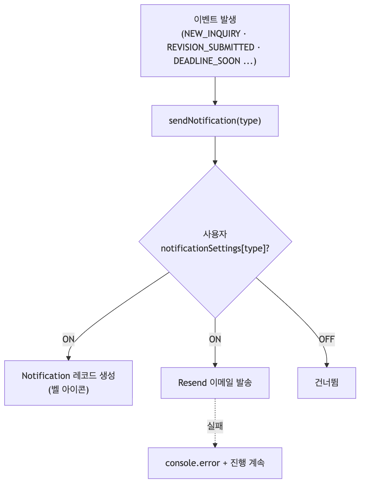

이메일 발송 실패가 비즈니스 로직을 중단시키지 않도록, 실패는 로깅 후 계속 진행(graceful degradation)한다.

---

## 6. 트러블슈팅

실제 개발·운영 중 마주친 문제와 해결 과정이다.

### TS-1. Next.js 16 `middleware.ts` → `proxy.ts` 마이그레이션

**문제**: Next.js 16에서 라우트 보호 미들웨어의 컨벤션이 변경되어 기존 `middleware.ts` 패턴이 동작하지 않음.

**해결**: 루트 `proxy.ts`로 전환하고 `NextAuth(authConfig)`의 `auth` 래퍼로 미인증 리다이렉트·RBAC redirect를 처리. `matcher` config로 보호 대상 경로를 명시. → constitution P-004(Next.js 버전 준수)로 못박아 재발 방지.

### TS-2. HMR 환경의 stale Prisma Client (런타임 모델 불일치)

**문제**: 개발 중 스키마에 새 모델/필드(`revisionComment`, `Asset.shareScheduledAt`, `RevisionRequest.assets`)를 추가하면, `globalThis`에 캐싱된 기존 Prisma 클라이언트가 새 델리게이트를 모른 채 남아 `undefined` 호출 에러 발생.

**해결**: `lib/db.ts`에 `hasCurrentDelegates()` 가드를 도입. 캐싱된 클라이언트의 `_runtimeDataModel`을 검사해 최신 모델 델리게이트 보유 여부를 확인하고, 구버전이면 `$disconnect()` 후 재생성한다.

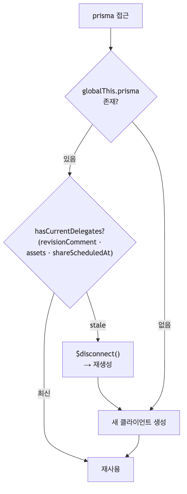

### TS-3. Prisma 비표준 생성 경로

**문제**: `generator output`이 `app/generated/prisma`로 설정되어 일반적인 `@prisma/client` import가 동작하지 않음.

**해결**: 모든 import를 `@/app/generated/prisma/client`로 통일. context.md의 "알려진 제약"에 명시해 신규 작업자(및 AI 에이전트)가 동일 실수를 반복하지 않도록 문서화.

### TS-4. Vercel Hobby 플랜 Cron 1개 제한

**문제**: 마감 리마인더와 정기 결제를 각각 별도 크론(`/api/cron/deadline-reminder`, `/api/cron/billing`)으로 설계했으나, Vercel Hobby 플랜은 Cron job을 1개만 허용.

**해결**: `vercel.json`을 단일 **`/api/cron/daily`** 크론(`0 0 * * *`)으로 통합하고, 핸들러 내부에서 마감 알림·정기 결제 작업을 순차 실행하도록 일원화. 플랜 제약을 코드 구조로 흡수.

### TS-5. 서버리스 연결 고갈

**문제**: Vercel 서버리스 함수가 매 요청마다 DB 연결을 맺으면 Neon 연결 풀이 고갈될 위험.

**해결**: Neon **pooled connection** + Prisma 싱글턴(`globalForPrisma`) 패턴으로 연결 재사용. 프로덕션에서는 함수 인스턴스 단위로 클라이언트를 공유.

### TS-6. 외부 SaaS 미설정 시 앱 크래시 방지

**문제**: Upstash·Resend·R2 키가 없는 환경(로컬·CI)에서 모듈 초기화가 실패하면 앱 전체가 죽음.

**해결**: 각 외부 의존성을 **선택적(optional)**으로 설계. `lib/ratelimit.ts`는 Upstash 미설정 시 limiter를 `null`로 두고 `check()`가 `{ limited: false }`를 반환하는 no-op로 동작. CI는 더미 환경변수로 빌드·테스트 통과.

### TS-7. 운영 알림의 민감정보 노출 방지

**문제**: 운영 이벤트를 Discord로 알릴 때 context에 secret/token/DB URL이 섞여 들어갈 수 있음.

**해결**: `lib/ops-sanitize.ts`가 `secret`/`token`/`password`/`authorization`/`cookie`/`key`/`dsn`/`database_url`/`webhook` 계열 키를 `[REDACTED]`로 마스킹한 뒤 전송. Health Check degraded 시에도 동일 마스킹 적용.

---

## 7. 배포 & 운영

### 7-1. CI 파이프라인

`main` push / PR마다 GitHub Actions가 **Lint → Typecheck → Test → Build** 4단계를 검증한다.

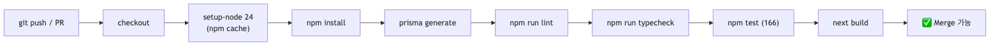

빌드 단계는 더미 환경변수를 주입해 외부 키 없이도 검증 가능하도록 구성.

### 7-2. 배포 흐름

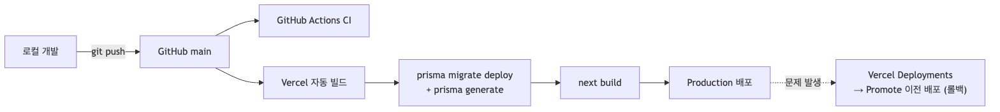

- **빌드 스크립트**: `prisma generate → prisma migrate deploy → next build`로 마이그레이션을 배포 파이프라인에 통합.
- **롤백**: Vercel 대시보드에서 이전 배포를 Production으로 Promote하는 무중단 롤백.

### 7-3. 관측성 & 운영 알림

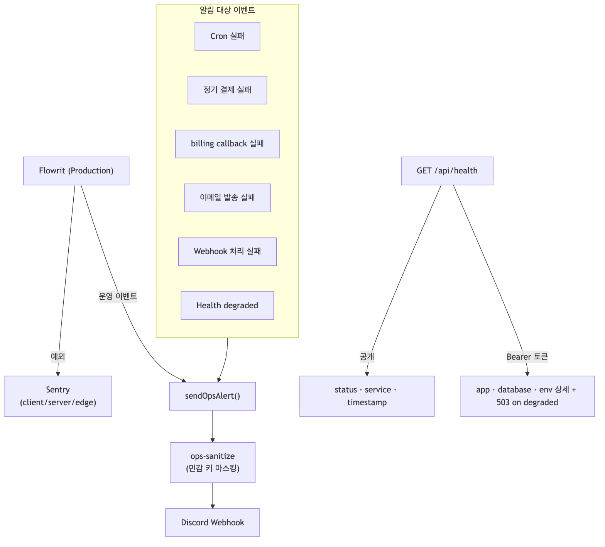

- **Sentry**: client/server/edge 3종 설정으로 전 구간 에러 추적.
- **Discord 운영 알림**: 핵심 실패 이벤트를 마스킹 후 실시간 통지 → 운영자 즉시 인지.
- **Health Check**: 공개 요약 + 토큰 보호 상세. degraded 시 503 반환 + Discord 알림.

### 7-4. 스케줄러

`/api/cron/daily` 단일 크론(매일 자정 UTC)이 `CRON_SECRET` Bearer 인증 하에 마감 리마인더·정기 결제를 순차 처리한다. (Hobby 플랜 1-크론 제약 대응 — [TS-4](#ts-4-vercel-hobby-플랜-cron-1개-제한))

---

## 8. 품질 관리

프로젝트 불변 원칙을 **constitution**으로 문서화하고, 모든 변경이 이를 준수하도록 게이트를 둔다.

| 원칙 | 내용 | 검증 |
|---|---|---|
| P-001 | 워크스페이스 데이터 격리 | 모든 쿼리 `workspaceId` scope |
| P-002 | RBAC 역할 경계 | 라우트·UI·액션 3중 보호 |
| P-003 | NextAuth JWT 단일 세션 | 세션 외 인증 상태 금지 |
| P-004 | Next.js 16 준수 | `proxy.ts`·Server Actions·async 컴포넌트 |
| P-005 | 업로드 10MB 제한 | `MAX_UPLOAD_SIZE` 단일 상수 |
| P-006 | 테스트 필수 | 신규 Server Action에 Vitest 동반 |

**테스트 전략**:

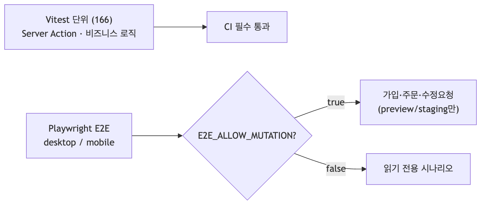

- **단위 테스트**: Server Action과 핵심 로직을 Vitest로 검증, CI에서 필수 통과.
- **E2E 테스트**: Playwright로 desktop/mobile 프로젝트 분리. mutating 시나리오는 `E2E_ALLOW_MUTATION` 가드로 production 데이터 보호.

---

> 이 문서는 코드베이스의 실제 구현(`prisma/schema.prisma`, `lib/`, `proxy.ts`, `vercel.json`, `.github/workflows/ci.yml`)과 프로젝트 설계 문서(`.claude/docs/`)를 근거로 작성되었습니다.
